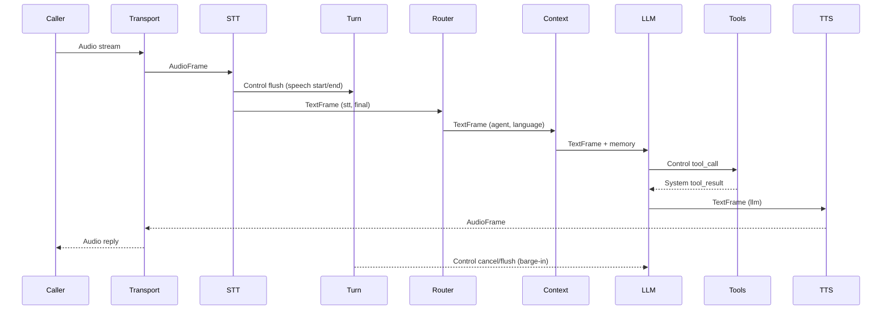

# Anatomy of Ranya

Ranya is a living system: audio arrives, meaning is formed, decisions are made, and replies are spoken. This page explains **why each module exists**, **how modules connect**, and **when to touch them**. It is written for engineers who need to debug, extend, or safely replace parts.

## 1. DNA — Core Principles

- Deterministic streaming: frames flow forward and are transformed, not mutated in place.
- Provider-agnostic interfaces: vendor SDKs are isolated behind adapters.
- Explicit state: routing, language, and turn state live in metadata, not hidden globals.
- Observability-first: every stage can emit timeline and cost events.
- Privacy by default: redaction can be enforced centrally.

## 2. Skeleton — Engine and Config

- **Module**: `pkg/ranya`, `pkg/configutil`, `pkg/pipeline`.
- **Metaphor**: The skeleton keeps the system upright and consistent.
- **Why it exists**: It assembles providers, processors, and transport into a stable runtime with defaults.
- **Connects**: `ranya.NewEngine` builds the pipeline and injects providers; `configutil` validates YAML; `pipeline` defines the `FrameProcessor` contract.
- **Touch when**: wiring providers, changing defaults, adding processors.

## 3. Lungs — Transport

- **Module**: `pkg/transports`, `pkg/ranya/engine.go`.
- **Metaphor**: Lungs exchange air with the outside world.
- **Why it exists**: Telephony protocols vary; transport normalizes them into frames.
- **Connects**: emits `AudioFrame` and transport metadata; receives outbound audio frames.
- **Touch when**: integrating new telephony protocols or custom ingress.

## 4. Heart — The Voice Pipeline

- **Module**: `pkg/pipeline`, `pkg/frames`, `pkg/priority`.
- **Metaphor**: The conveyor belt that never runs backward.
- **Why it exists**: Telephony needs predictable latency and safe interruption handling.
- **Key concepts**: frames as the atom of work, unidirectional flow, priority for control frames, the Turn Manager as a "traffic cop".
- **Touch when**: tuning latency, backpressure, or stage ordering.

## 5. Brain — Reasoning, Routing, and Memory

- **Module**: `pkg/processors/llm.go`, `pkg/processors/router.go`, `pkg/processors/context.go`, `pkg/llm`.
- **Metaphor**: The brain interprets intent and chooses the right persona.
- **Why it exists**: Voice agents need routing, memory, and tool calling to stay coherent.
- **Connects**: Router chooses `agent` and `global_*` metadata; Context injects prompts; LLM emits tool calls and streaming text.
- **Touch when**: adding memory behavior, custom routing, or tool logic.

## 6. Ears — Speech to Text

- **Module**: `pkg/processors/stt_processor.go`, `pkg/providers/*` (STT).
- **Metaphor**: Ears convert sound into meaning.
- **Why it exists**: STT needs buffering, replay, and vendor isolation.
- **Connects**: emits `TextFrame` with `source=stt` and `is_final`; emits `flush` control frames for turn logic.
- **Touch when**: STT buffering, interim handling, or vendor changes.

## 7. Voice — Text to Speech

- **Module**: `pkg/processors/tts_processor.go`, `pkg/providers/*` (TTS).
- **Metaphor**: Voice turns intent into audio.
- **Why it exists**: TTS must stream audio and coordinate playback state.
- **Connects**: consumes LLM text frames; emits audio frames; signals `audio_ready`.
- **Touch when**: audio streaming, language-based voices, interruption behavior.

## 8. Nervous System — Turn Management

- **Module**: `pkg/turn`, `pkg/processors/manager.go`.
- **Metaphor**: The nervous system reacts to sudden changes.
- **Why it exists**: Interruptions and silence must be handled consistently across providers.
- **Connects**: reads `flush`, `audio_ready`, and thinking events; emits `cancel` and `flush`.
- **Touch when**: barge-in and silence reprompt tuning.

## 9. Hands — Tools and Actions

- **Module**: `pkg/ranya/dispatcher.go`, `pkg/llm/tools.go`.
- **Metaphor**: Hands do real work in the world.
- **Why it exists**: Tools need retries, timeouts, and confirmations separated from the LLM.
- **Connects**: `tool_call` control frames in, `tool_result` system frames out.
- **Touch when**: adding tool safety, idempotency, or confirmation rules.

## 10. Immune System — Resilience and Recovery

- **Module**: `pkg/resilience`, `pkg/errorsx`, `pkg/processors/recovery.go`.
- **Metaphor**: The immune system detects failures and recovers.
- **Why it exists**: Vendor outages should degrade gracefully, not crash calls.
- **Connects**: circuit breakers, error mapping, and recovery prompts.
- **Touch when**: fallback behavior, error handling, or vendor recovery policies.

## 11. Eyes — Observability

- **Module**: `pkg/metrics`, `pkg/observers`.
- **Metaphor**: Eyes record what happened for review.
- **Why it exists**: Debugging calls needs timelines, latency, and costs.
- **Connects**: observers subscribe to stages and write JSONL artifacts.
- **Touch when**: adding sinks, redaction rules, or cost tracking.

## 12. Memory — Summaries and Context Limits

- **Module**: `pkg/processors/summary.go`, `pkg/processors/context.go`.
- **Metaphor**: Memory keeps the story coherent without overload.
- **Why it exists**: LLM context is limited; summaries preserve key facts.
- **Connects**: summary runs on `call_end`; context trims history by limits.
- **Touch when**: summary generation or context limits.

## 13. Skin — Privacy

- **Module**: `pkg/redact`.
- **Metaphor**: Skin protects sensitive data.
- **Why it exists**: Telephony contains PII; logs must be safe by default.
- **Connects**: redaction hooks in logging and LLM inputs.
- **Touch when**: PII policy or log handling.
