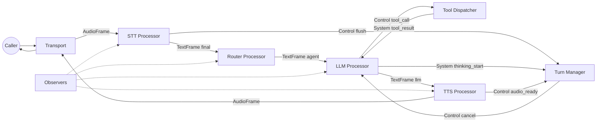

# Architecture

This page is the system map: boundaries, flow, and extension points.

## System Boundaries

- **Transport boundary** converts telephony events into frames.
- **Provider boundary** isolates vendor SDKs behind adapters.
- **Core pipeline** contains deterministic processors.
- **Observers** record what happened without changing behavior.

## End‑to‑End Flow

1. Transport receives audio and emits `AudioFrame` with metadata.
2. STT converts audio into `TextFrame` with `source=stt` and `is_final=true` when complete.
3. Router optionally adds `agent` and `global_*` fields based on the final text.
4. LLM consumes text and context, emits streaming text and optional tool calls.
5. Tool calls go to `ToolDispatcher`, then back as `tool_result` system frames.
6. TTS converts LLM text into `AudioFrame` for the transport.
7. Turn manager watches frames to handle barge‑in, end‑of‑turn, and silence reprompts.

## Component Diagram

## Extension Points (Where You Add Logic)

- **Before LLM**: text normalization, custom prompts, sensitive filtering.
- **Before TTS**: response shaping, truncation, localization.
- **Pre/Post processors**: logging, serialization, analytics hooks.

## What You Can Swap Without Code Changes

- STT, TTS, LLM, and Transport providers via config.

## What Requires Code Changes

- New processors.
- Custom transport protocols.
- New tool registry logic.

## Related Pages

- [Pipeline and Backpressure](pipeline.md)
- [Routing and Language](routing.md)
- [Tools and Confirmation](tools-confirmation.md)
- [Observability](observability.md)
