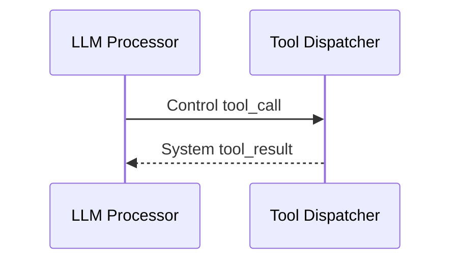

# Frames and Metadata

Frames are the unit of work in Ranya. Each processor reads a frame and emits zero or more frames. Frames carry a `stream_id` and a metadata map so processors can coordinate without shared structs.

## Required Metadata (Practical)

- `stream_id`: routing key across processors.
- `source`: who produced the frame (`stt`, `llm`, `turn`, `transport`).
- `is_final`: final STT transcripts.

If these are missing or wrong, routing and turn logic will fail.

## Frame Kinds
| Kind | Purpose | Typical source |
| --- | --- | --- |
| `audio` | Raw audio payloads. | Transport, TTS |
| `text` | Transcripts and LLM output. | STT, LLM |
| `control` | Control signals for the pipeline. | Turn, LLM |
| `system` | Non‑user‑visible events. | LLM, ToolDispatcher, Turn |
| `image` | Optional image input. | Transport or app |

## Control Codes (Most Used)
| Code | Meaning |
| --- | --- |
| `flush` | Force downstream to flush buffers. |
| `cancel` | Cancel current speech or playback. |
| `tool_call` | Execute a tool. |
| `audio_ready` | TTS finished playback. |
| `handoff` | Switch active agent. |

## Common Mistakes

- Emitting text frames without `source=stt` or `source=llm`.
- Forgetting `is_final=true` for final transcripts.
- Mutating frames instead of creating new ones.

## Example: Tool Call Round Trip

## Debug Checklist

- Is `stream_id` present and consistent?
- Do final STT frames have `is_final=true`?
- Do control frames appear before interruptions?
