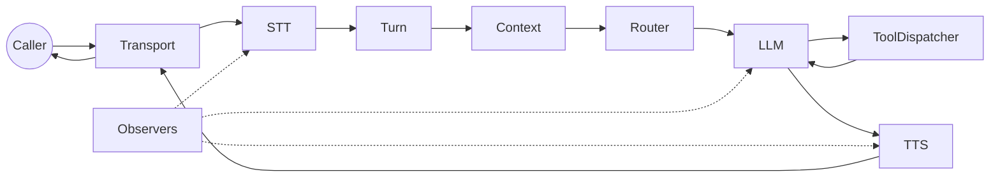

Streaming Telephony Framework

# Ranya

Enterprise‑grade voice agents for real calls: deterministic pipelines, safe tool execution, and first‑class observability.

[Start Here](start-here.md){.md-button .md-button--primary}
[Task Flows](task-flows.md){.md-button}

[GitHub Repository](https://github.com/harunnryd/ranya)
[Star](https://github.com/harunnryd/ranya/stargazers)
[Fork](https://github.com/harunnryd/ranya/network/members)

## What You Can Build

- **Inbound support lines**  
  Barge‑in safe, fast routing, stable latency.

- **Outbound call flows**  
  Reliable turn state, interruption handling.

- **Tool‑powered voice agents**  
  Confirmed actions with retries and idempotency.

- **Multi‑language deployments**  
  Language detection and per‑provider routing.

## Top Tasks

- **Get a Call Working**  
  Run the reference and verify end‑to‑end flow.  
  [Task 1: Get a Call Working](task-1-call.md)

- **Add Tools**  
  Define tool schemas and confirmations.  
  [Task 2: Add Tools](task-2-tools.md)

- **Add Routing + Language**  
  Route agents and detect language early.  
  [Task 3: Add Routing + Language](task-3-routing.md)

- **Enable Observability**  
  Add artifacts, trace IDs, and debug timelines.  
  [Task 4: Enable Observability](task-4-observability.md)

## Decision Points That Matter

- **Latency vs completeness**: `pipeline.backpressure` and queue sizes.  
  [Pipeline and Backpressure](pipeline.md)

- **Barge‑in behavior**: `turn.min_barge_in_ms` and reprompts.  
  [Turn Management](turn-management.md)

- **Tool safety**: confirmation mode and timeouts.  
  [Tools and Confirmation](tools-confirmation.md)

- **Routing strategy**: `router.mode` and language detection.  
  [Routing and Language](routing.md)

- **Debug strategy**: enable artifacts and trace IDs.  
  [Observability](observability.md)

## Data Flow (High‑Level)

