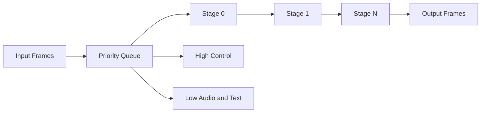

# Pipeline and Backpressure

Ranya uses a staged pipeline that runs per call. The pipeline accepts frames, routes them through processors, and emits frames to the transport.

## Default Processor Order
The default engine builds this sequence in `pkg/ranya/engine.go`:

1. Pre‑processors (acoustic, network simulation).
2. STT processor.
3. Turn processor.
4. Before‑context processors.
5. Context processor.
6. Router processor.
7. Before‑LLM processors.
8. LLM processor.
9. Tool dispatcher.
10. Before‑TTS processors.
11. TTS processor.
12. Post‑processors (serializers).

Custom apps can add or remove stages through `EngineOptions`.

## Backpressure Modes

- `pipeline.backpressure=drop` drops frames when a channel is full.
- `pipeline.backpressure=wait` blocks until space is available.

When to use each:

- **Drop** for live calls where latency matters more than completeness.
- **Wait** for offline or test runs where you want every frame.

## Tuning Recipes
| Goal | Settings |
| --- | --- |
| Lowest latency | `backpressure=drop`, smaller buffers. |
| Highest reliability | `backpressure=wait`, larger buffers. |
| Debug deterministically | `pipeline.async=false`. |
| Handle heavy load | increase `highcapacity`, `lowcapacity`, `stagebuffer`. |

## Diagram

