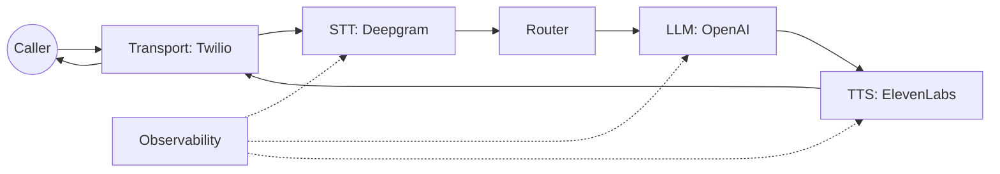

# Task 1: Get a Call Working

Goal: complete one end-to-end call with real providers (Twilio + STT + TTS + LLM).

## Step 0: Choose Providers
Recommended stack (matches the reference example):

- Transport: Twilio
- STT: Deepgram
- TTS: ElevenLabs
- LLM: OpenAI

Why: the HVAC example wires this stack end-to-end and gives you a known-good baseline before you customize.

## System Map


## Step 1: Copy the Reference Config
```bash
cp examples/hvac/config.yaml config.yaml
```

Minimum required fields:

- `transports.provider`
- `vendors.stt.provider`
- `vendors.tts.provider`
- `vendors.llm.provider`

Minimal config shape (trimmed):
```yaml
transports:
  provider: twilio
  settings:
    account_sid: "${TWILIO_ACCOUNT_SID}"
    auth_token: "${TWILIO_AUTH_TOKEN}"
    public_url: "${TWILIO_PUBLIC_URL}"

vendors:
  stt:
    provider: deepgram
    settings:
      api_key: "${DEEPGRAM_API_KEY}"
      model: "nova-2"
  tts:
    provider: elevenlabs
    settings:
      api_key: "${ELEVENLABS_API_KEY}"
      voice_id: "${ELEVENLABS_VOICE_ID}"
  llm:
    provider: openai
    settings:
      api_key: "${OPENAI_API_KEY}"
      model: "gpt-4o-mini"
```

## Step 2: Provide Credentials
Set the environment variables used by the config:

- `TWILIO_ACCOUNT_SID`
- `TWILIO_AUTH_TOKEN`
- `TWILIO_PUBLIC_URL`
- `DEEPGRAM_API_KEY`
- `ELEVENLABS_API_KEY`
- `ELEVENLABS_VOICE_ID`
- `OPENAI_API_KEY`

`TWILIO_PUBLIC_URL` must be publicly reachable. If you are local, use a tunnel (ngrok, cloudflared).

## Step 3: Run the Example
```bash
go run ./examples/hvac --config config.yaml
```

What to expect:

- `ranya_init` log shows chosen providers.
- Twilio transport listens on `transports.settings.server_addr` (default `:8080`).

## Step 4: Point Your Phone Number at Ranya
Set the Twilio Voice webhook to:
`https://<public-url>/voice`

Ranya returns TwiML that opens the media stream at `ws_path` (default `/ws`).

## Step 5: Verify End-to-End Flow
You should see:

- STT frames with `source=stt` and `is_final=true`.
- LLM text frames streaming back.
- TTS audio frames sent to the transport.

Enable artifacts to see a timeline:
```yaml
observability:
  artifacts_dir: "examples/hvac/artifacts"
```

## Step 6: Debug Fast (Timeline First)

1. Grab `trace_id` from logs.
2. Open the timeline JSONL in `artifacts_dir`.
3. Find the last `frame_out` and fix the stage that stopped emitting frames.

Common fixes:

- No inbound hits: `TWILIO_PUBLIC_URL` not reachable or wrong `voice_path`.
- No final STT: STT config mismatch or audio encoding mismatch.
- LLM silent: missing API key or wrong model.
- TTS silent: invalid voice ID or output format mismatch.

<div class="r-quick-links" markdown>
Related:

- [Providers](providers.md)
- [Observability](observability.md)
- [Troubleshooting](troubleshooting.md)
</div>

## Done When

- A real call completes end-to-end.
- You can pinpoint failures from the timeline.
- You can swap one provider without code changes.
