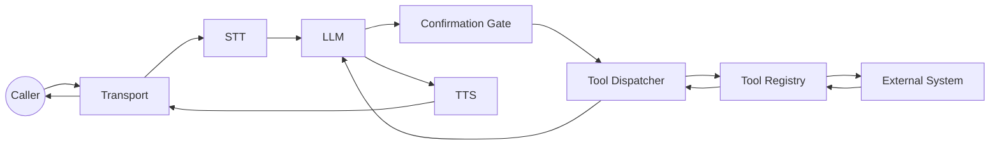

# Task 2: Add Tools (Business Actions)

Goal: safely execute real actions with confirmations, retries, and timeouts.

## Step 0: Decide Tool Boundaries
Use tools for side effects (booking, payments, tickets), not for pure reasoning.
This keeps the LLM deterministic and audit-friendly.

## System Map


## Step 1: Define Tool Schemas
```go
llm.Tool{
  Name: "schedule_visit",
  Description: "Schedule a technician visit.",
  RequiresConfirmation: true,
  ConfirmationPromptByLanguage: map[string]string{
    "id": "Sebelum saya jadwalkan kunjungan, apakah Anda ingin saya lanjutkan?",
    "en": "Before I schedule the visit, do you want me to proceed?",
  },
  Schema: map[string]any{
    "type": "object",
    "properties": map[string]any{
      "location": map[string]any{"type": "string"},
      "preferred_time": map[string]any{"type": "string"},
    },
    "required": []string{"location", "preferred_time"},
  },
}
```

Why: the schema makes tool calls structured and lets the LLM validate inputs before executing.

## Step 2: Implement `llm.ToolRegistry`
```go
type HVACTools struct{}

func (t *HVACTools) Tools() []llm.Tool {
  return []llm.Tool{ /* tool definitions */ }
}

func (t *HVACTools) HandleTool(name string, args map[string]any) (string, error) {
  switch name {
  case "schedule_visit":
    // call your system, return a summary string for the LLM
    return "visit scheduled for Tue 10am, confirmation id ABC123", nil
  default:
    return "", fmt.Errorf("unknown tool: %s", name)
  }
}
```

Return value becomes part of the LLM context, so keep it short and factual.

## Step 3: Wire Tools Into the Engine
```go
tools := &HVACTools{}
engine := ranya.NewEngine(ranya.EngineOptions{
  Config: cfg,
  Tools:  tools,
})
```

## Step 4: Configure Safety Defaults
```yaml
tools:
  timeout_ms: 6000
  retries: 1
  retry_backoff_ms: 200
  serialize_by_stream: true

confirmation:
  mode: "llm"
  llm_fallback: true
  timeout_ms: 600
```

Why: you want bounded execution time and clear confirmation behavior before any side effect.

## Step 5: Teach the LLM When to Use Tools
Update `base_prompt` to mention the tools and the required fields.
Without this, the model may never call them.

## Step 6: Validate in a Call
You should see:

- `tool_call` control frames.
- `tool_result` system frames.
- Confirmation prompts before execution.

## Common Fixes

- Tool never runs: tool name mismatch or prompt never mentions it.
- Confirmations loop: user replies are unclear; enable `confirmation.llm_fallback`.
- Timeouts: increase `tools.timeout_ms` or optimize the handler.

<div class="r-quick-links" markdown>
Related:

- [Tools and Confirmation](tools-confirmation.md)
- [Frames and Metadata](frames.md)
- [Observability](observability.md)
</div>
