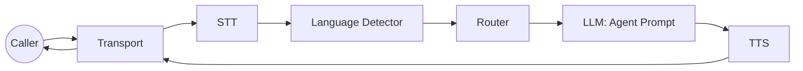

# Task 3: Add Routing + Language

Goal: choose the right agent (and language) before the LLM runs.

## Step 0: Decide Your Routing Mode
Set `router.mode` in config:

- `off`: single-agent flows.
- `bootstrap`: route only the first N turns.
- `full`: route every final STT turn.

Why: routing early keeps prompts focused and reduces LLM overhead.

## System Map


## Step 1: Define Agents
```go
agents := map[string]processors.AgentConfig{
  "triage": {Name: "triage", System: "You are the triage agent."},
  "technical": {Name: "technical", System: "You handle technical issues."},
  "billing": {Name: "billing", System: "You handle billing and payments."},
}
```

## Step 2: Pick a Router Strategy
The HVAC example ships an LLM router:
```go
llmAdapter, _ := providers.BuildLLM(cfg.Vendors.LLM.Provider, cfg)
router := NewLLMRouterStrategy(llmAdapter, nil, LLMRouterConfig{})
```

You can implement your own `processors.RouterStrategy` if you want rules instead of LLM decisions.

## Step 3: Wire Router + Agents Into the Engine
```go
engine := ranya.NewEngine(ranya.EngineOptions{
  Config: cfg,
  Agents: agents,
  Router: router,
})
```

## Step 4: Add Language Detection (Optional)
The HVAC example uses an LLM-based detector:
```go
langDetector := NewLLMLanguageDetector(llmAdapter)
engine := ranya.NewEngine(ranya.EngineOptions{
  Config:           cfg,
  Agents:           agents,
  Router:           router,
  LanguageDetector: langDetector,
  LanguagePrompts:  map[string]string{"id": "...", "en": "..."},
  LanguageMinConf:  0.55,
  DefaultLanguage:  cfg.Languages.Default,
})
```

Config hooks:
```yaml
router:
  mode: "bootstrap"
  max_turns: 2

languages:
  default: "id"
  code_switching: true
  prompts:
    id: "Gunakan Bahasa Indonesia."
    en: "Use English."
```

## Step 5: Verify Routing Works
You should see:

- `global_update` system frames when routing selects an agent or language.
- `agent` metadata on downstream text frames.

## Common Fixes

- Router never runs: ensure STT frames have `source=stt` and `is_final=true`.
- Agent never sticks: `router.mode` is `off` or `max_turns` is 0.
- Language never detected: `LanguageDetector` not wired or confidence too low.

<div class="r-quick-links" markdown>
Related:

- [Routing and Language](routing.md)
- [Frames and Metadata](frames.md)
- [Configuration](configuration.md)
</div>
