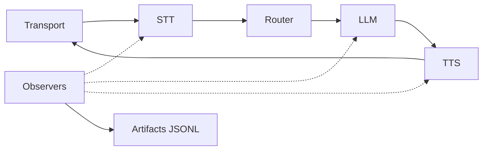

# Task 4: Enable Observability and Debugging

Goal: make every call debuggable with a timeline and trace IDs.

## System Map


## Step 1: Enable Artifacts
```yaml
observability:
  artifacts_dir: "examples/hvac/artifacts"
  record_audio: false
  retention_days: 0
```

`artifacts_dir` is required. Keep `record_audio=false` unless you have an explicit privacy policy.

## Step 2: Prefer Structured Logs
```yaml
log_format: "json"
log_level: "info"
```

This makes it easy to search by `trace_id`.

## Step 3: Debug a Single Call

1. Find the `trace_id` in logs.
2. Open the JSONL file for that call in `artifacts_dir`.
3. Locate the last `frame_out` and trace back to the stage that stopped.

## Step 4: Watch for Cost and Latency
When artifacts are enabled, Ranya writes timeline and cost events. Use these to:

- compare vendor latency,
- detect slow tool calls,
- validate routing decisions.

## Common Fixes

- No artifacts: `artifacts_dir` missing or not writable.
- Timeline stops early: a processor failed or backpressure dropped frames.
- Unexpected costs: check tool calls or long responses.

<div class="r-quick-links" markdown>
Related:

- [Observability](observability.md)
- [Troubleshooting](troubleshooting.md)
</div>

## Done When

- You can find a call’s trace in under 60 seconds.
- You can pinpoint the stage that stalled.
- You can explain latency and cost per call.
