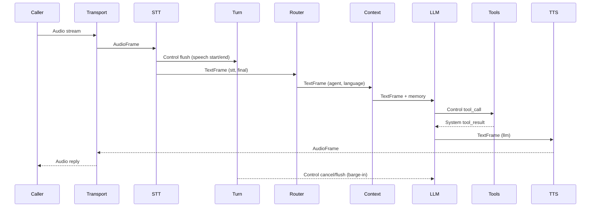

# Anatomi Ranya

Ranya adalah sistem hidup: audio masuk, makna dibentuk, keputusan diambil, lalu jawaban diucapkan. Halaman ini menjelaskan **kenapa tiap modul ada**, **bagaimana modul terhubung**, dan **kapan kamu menyentuhnya**. Ditulis untuk engineer yang perlu debug, memperluas, atau mengganti bagian dengan aman.

## 1. DNA — Prinsip Inti

- Streaming deterministik: frame mengalir maju dan ditransformasi, bukan dimutasi sembarang.
- Interface provider-agnostik: SDK vendor diisolasi di adapter.
- State eksplisit: routing, bahasa, dan turn disimpan di metadata.
- Observability-first: tiap stage bisa menulis timeline dan biaya.
- Privasi default: redaksi dapat dipaksa secara terpusat.

## 2. Skeleton — Engine dan Konfigurasi

- **Modul**: `pkg/ranya`, `pkg/configutil`, `pkg/pipeline`.
- **Metafora**: Kerangka menjaga sistem tetap tegak dan konsisten.
- **Kenapa ada**: menyatukan provider, processor, dan transport menjadi runtime stabil dengan default.
- **Koneksi**: `ranya.NewEngine` membangun pipeline dan menyuntikkan provider; `configutil` memvalidasi YAML; `pipeline` mendefinisikan kontrak `FrameProcessor`.
- **Sentuh saat**: wiring provider, mengubah default, menambah processor.

## 3. Lungs — Transport

- **Modul**: `pkg/transports`, `pkg/ranya/engine.go`.
- **Metafora**: Paru-paru menukar udara dengan dunia luar.
- **Kenapa ada**: protokol telephony berbeda-beda; transport menormalkan jadi frame.
- **Koneksi**: mengeluarkan `AudioFrame` dan metadata transport; menerima audio outbound.
- **Sentuh saat**: integrasi protokol telephony baru atau ingress custom.

## 4. Heart — Voice Pipeline

- **Modul**: `pkg/pipeline`, `pkg/frames`, `pkg/priority`.
- **Metafora**: Conveyor belt yang tidak pernah berjalan mundur.
- **Kenapa ada**: telephony butuh latensi terprediksi dan interruption yang aman.
- **Konsep kunci**: frame sebagai atom kerja, alur satu arah, prioritas control frame, Turn Manager sebagai "traffic cop".
- **Sentuh saat**: tuning latency, backpressure, atau urutan stage.

## 5. Brain — Reasoning, Routing, and Memory

- **Modul**: `pkg/processors/llm.go`, `pkg/processors/router.go`, `pkg/processors/context.go`, `pkg/llm`.
- **Metafora**: Otak menafsirkan niat dan memilih persona yang tepat.
- **Kenapa ada**: voice agent butuh routing, memori, dan tool calling agar tetap koheren.
- **Koneksi**: Router memilih `agent` dan metadata `global_*`; Context menyuntikkan prompt; LLM mengeluarkan tool call dan text streaming.
- **Sentuh saat**: menambah behavior memori, custom routing, atau logika tool.

## 6. Ears — Speech to Text

- **Modul**: `pkg/processors/stt_processor.go`, `pkg/providers/*` (STT).
- **Metafora**: Telinga mengubah suara menjadi makna.
- **Kenapa ada**: STT butuh buffering, replay, dan isolasi vendor.
- **Koneksi**: mengeluarkan `TextFrame` dengan `source=stt` dan `is_final`; mengirim `flush` untuk turn.
- **Sentuh saat**: buffering STT, interim handling, atau ganti vendor.

## 7. Voice — Text to Speech

- **Modul**: `pkg/processors/tts_processor.go`, `pkg/providers/*` (TTS).
- **Metafora**: Suara mengubah niat menjadi audio.
- **Kenapa ada**: TTS harus streaming audio dan sinkron dengan playback.
- **Koneksi**: konsumsi text dari LLM; keluarkan audio; kirim sinyal `audio_ready`.
- **Sentuh saat**: streaming audio, voice per bahasa, behavior interruption.

## 8. Nervous System — Turn Management

- **Modul**: `pkg/turn`, `pkg/processors/manager.go`.
- **Metafora**: Sistem saraf bereaksi terhadap perubahan mendadak.
- **Kenapa ada**: interruption dan silence harus konsisten lintas vendor.
- **Koneksi**: membaca `flush`, `audio_ready`, dan event thinking; mengirim `cancel` dan `flush`.
- **Sentuh saat**: tuning barge-in dan silence reprompt.

## 9. Hands — Tools and Actions

- **Modul**: `pkg/ranya/dispatcher.go`, `pkg/llm/tools.go`.
- **Metafora**: Tangan melakukan aksi nyata.
- **Kenapa ada**: tool perlu retry, timeout, dan konfirmasi di luar LLM.
- **Koneksi**: `tool_call` masuk, `tool_result` keluar.
- **Sentuh saat**: menambah safety tool, idempotensi, atau aturan konfirmasi.

## 10. Immune System — Resilience and Recovery

- **Modul**: `pkg/resilience`, `pkg/errorsx`, `pkg/processors/recovery.go`.
- **Metafora**: Sistem imun mendeteksi kegagalan dan pulih.
- **Kenapa ada**: outage vendor harus gagal secara aman, bukan memutus call.
- **Koneksi**: circuit breaker, error mapping, dan recovery prompt.
- **Sentuh saat**: fallback behavior, error handling, atau kebijakan recovery.

## 11. Eyes — Observability

- **Modul**: `pkg/metrics`, `pkg/observers`.
- **Metafora**: Mata merekam apa yang terjadi untuk ditinjau.
- **Kenapa ada**: debug call butuh timeline, latensi, dan biaya.
- **Koneksi**: observer subscribe ke stage dan menulis artifak JSONL.
- **Sentuh saat**: menambah sink, aturan redaksi, atau cost tracking.

## 12. Memory — Summaries and Context Limits

- **Modul**: `pkg/processors/summary.go`, `pkg/processors/context.go`.
- **Metafora**: Memori menjaga cerita tetap koheren tanpa overload.
- **Kenapa ada**: konteks LLM terbatas; ringkasan menyimpan fakta penting.
- **Koneksi**: summary berjalan saat `call_end`; context memangkas history.
- **Sentuh saat**: ringkasan atau limit konteks.

## 13. Skin — Privacy

- **Modul**: `pkg/redact`.
- **Metafora**: Kulit melindungi data sensitif.
- **Kenapa ada**: telephony mengandung PII; log harus aman.
- **Koneksi**: redaksi ada di logging dan input LLM.
- **Sentuh saat**: kebijakan PII atau penanganan log.
