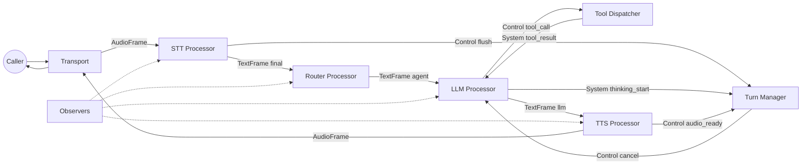

# Arsitektur

Halaman ini adalah peta sistem: boundary, alur, dan extension point.

## Batas Sistem

- **Transport boundary** mengubah event telephony menjadi frame.
- **Provider boundary** mengisolasi SDK vendor di balik adapter.
- **Core pipeline** berisi processor deterministik.
- **Observers** merekam apa yang terjadi tanpa mengubah perilaku.

## Alur End‑to‑End

1. Transport menerima audio dan memancarkan `AudioFrame` dengan metadata.
2. STT mengubah audio menjadi `TextFrame` dengan `source=stt` dan `is_final=true` saat selesai.
3. Router menambah `agent` dan `global_*` berdasarkan teks final.
4. LLM mengonsumsi teks dan konteks, memancarkan teks streaming dan tool call.
5. Tool call masuk ke `ToolDispatcher`, kembali sebagai `tool_result` system frame.
6. TTS mengubah teks LLM menjadi `AudioFrame` untuk transport.
7. Turn manager memantau frame untuk barge‑in, end‑of‑turn, dan reprompt.

## Diagram Komponen

## Extension Point

- **Before LLM**: normalisasi, prompt injection.
- **Before TTS**: formatting, truncation.
- **Post‑processor**: logging, analytics.

## Swap Tanpa Ubah Kode

- Provider STT/TTS/LLM/Transport via config.

## Perlu Ubah Kode

- Processor baru.
- Transport custom.
- Tool registry custom.
