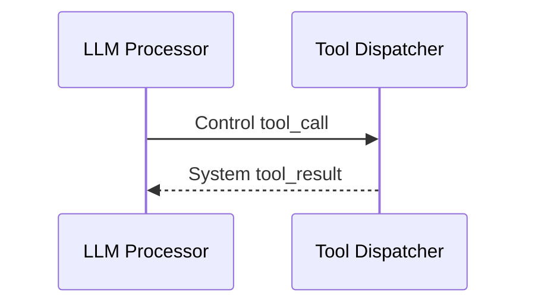

# Frame dan Metadata

Frame adalah unit kerja di Ranya. Setiap processor membaca frame dan memancarkan nol atau lebih frame.

## Metadata Wajib (Praktis)

- `stream_id`: key routing.
- `source`: siapa yang membuat frame.
- `is_final`: final STT transcript.

Jika ini salah, routing dan turn akan gagal.

## Jenis Frame
| Kind | Tujuan | Sumber umum |
| --- | --- | --- |
| `audio` | Payload audio mentah. | Transport, TTS |
| `text` | Transkrip dan output LLM. | STT, LLM |
| `control` | Sinyal kontrol. | Turn, LLM |
| `system` | Event non‑user‑visible. | LLM, ToolDispatcher, Turn |
| `image` | Input image opsional. | Transport atau aplikasi |

## Control Codes (Paling Sering)
| Code | Makna |
| --- | --- |
| `flush` | Paksa flush buffer.
| `cancel` | Batalkan speech/playback.
| `tool_call` | Eksekusi tool.
| `audio_ready` | TTS selesai.
| `handoff` | Ganti agent.

## Common Mistakes

- Text frame tanpa `source=stt`/`source=llm`.
- Final transcript tanpa `is_final=true`.
- Mutasi frame in‑place.

## Contoh: Tool Call

## Checklist Debug

- `stream_id` konsisten?
- Final STT punya `is_final=true`?
- Control frame muncul saat interruption?
