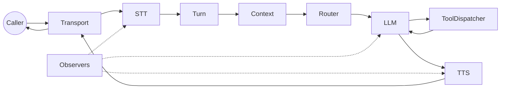

Framework Telephony Streaming

# Ranya

Voice agent enterprise‑grade untuk panggilan nyata: pipeline deterministik, eksekusi tool aman, dan observabilitas kelas satu.

[Mulai di Sini](start-here.md){.md-button .md-button--primary}
[Alur Tugas](task-flows.md){.md-button}

[Repositori GitHub](https://github.com/harunnryd/ranya)
[Star](https://github.com/harunnryd/ranya/stargazers)
[Fork](https://github.com/harunnryd/ranya/network/members)

## Yang Bisa Anda Bangun

- **Inbound support line**  
  Barge‑in aman, routing cepat, latensi stabil.

- **Outbound call flow**  
  State jelas dan interruption terkontrol.

- **Voice agent bertool**  
  Aksi aman dengan konfirmasi, retry, idempotensi.

- **Deploy multi‑bahasa**  
  Deteksi bahasa dan routing provider.

## Tugas Utama

- **Call Harus Jalan**  
  Jalankan referensi end‑to‑end.  
  [Tugas 1: Call Jalan](task-1-call.md)

- **Tambah Tools**  
  Schema + konfirmasi.  
  [Tugas 2: Tambah Tools](task-2-tools.md)

- **Routing + Bahasa**  
  Routing agent dan deteksi bahasa.  
  [Tugas 3: Routing + Bahasa](task-3-routing.md)

- **Observabilitas**  
  Artifak, trace ID, dan timeline debug.  
  [Tugas 4: Observabilitas](task-4-observability.md)

## Keputusan Penting

- **Latensi vs kelengkapan**: `pipeline.backpressure` dan kapasitas queue.  
  [Pipeline dan Backpressure](pipeline.md)

- **Perilaku barge‑in**: `turn.min_barge_in_ms` dan reprompt.  
  [Manajemen Giliran](turn-management.md)

- **Safety tools**: konfirmasi dan timeout.  
  [Tools dan Konfirmasi](tools-confirmation.md)

- **Strategi routing**: `router.mode` dan deteksi bahasa.  
  [Routing dan Bahasa](routing.md)

- **Debug cepat**: artifacts dan trace ID.  
  [Observabilitas](observability.md)

## Alur Data (High‑Level)

