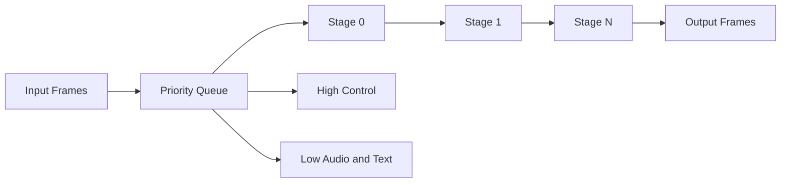

# Pipeline dan Backpressure

Ranya memakai pipeline bertahap yang berjalan per call.

## Urutan Processor Default
`pkg/ranya/engine.go`:

1. Pre‑processor
2. STT
3. Turn
4. Before‑context
5. Context
6. Router
7. Before‑LLM
8. LLM
9. Tool dispatcher
10. Before‑TTS
11. TTS
12. Post‑processors

## Mode Backpressure

- `drop`: frame dibuang saat penuh.
- `wait`: menunggu slot.

Kapan dipakai:

- **Drop** untuk latensi rendah.
- **Wait** untuk test/offline.

## Resep Tuning
| Target | Setting |
| --- | --- |
| Latensi terendah | `backpressure=drop`, buffer kecil. |
| Reliabilitas tinggi | `backpressure=wait`, buffer besar. |
| Debug deterministik | `pipeline.async=false`. |
| Beban tinggi | naikkan `highcapacity`, `lowcapacity`, `stagebuffer`. |

## Diagram

