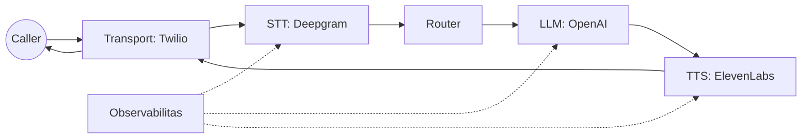

# Tugas 1: Call Jalan

Target: satu panggilan end-to-end dengan provider nyata (Twilio + STT + TTS + LLM).

## Step 0: Pilih Provider
Stack rekomendasi (sesuai contoh HVAC):

- Transport: Twilio
- STT: Deepgram
- TTS: ElevenLabs
- LLM: OpenAI

Kenapa: contoh HVAC sudah teruji end-to-end dan jadi baseline sebelum kamu custom.

## Peta Sistem


## Step 1: Salin Config Referensi
```bash
cp examples/hvac/config.yaml config.yaml
```

Field minimal wajib:

- `transports.provider`
- `vendors.stt.provider`
- `vendors.tts.provider`
- `vendors.llm.provider`

Contoh config minimal (dipersingkat):
```yaml
transports:
  provider: twilio
  settings:
    account_sid: "${TWILIO_ACCOUNT_SID}"
    auth_token: "${TWILIO_AUTH_TOKEN}"
    public_url: "${TWILIO_PUBLIC_URL}"

vendors:
  stt:
    provider: deepgram
    settings:
      api_key: "${DEEPGRAM_API_KEY}"
      model: "nova-2"
  tts:
    provider: elevenlabs
    settings:
      api_key: "${ELEVENLABS_API_KEY}"
      voice_id: "${ELEVENLABS_VOICE_ID}"
  llm:
    provider: openai
    settings:
      api_key: "${OPENAI_API_KEY}"
      model: "gpt-4o-mini"
```

## Step 2: Isi Kredensial
Set environment variables:

- `TWILIO_ACCOUNT_SID`
- `TWILIO_AUTH_TOKEN`
- `TWILIO_PUBLIC_URL`
- `DEEPGRAM_API_KEY`
- `ELEVENLABS_API_KEY`
- `ELEVENLABS_VOICE_ID`
- `OPENAI_API_KEY`

`TWILIO_PUBLIC_URL` harus bisa diakses publik. Jika lokal, gunakan tunnel (ngrok, cloudflared).

## Step 3: Jalankan Contoh
```bash
go run ./examples/hvac --config config.yaml
```

Yang diharapkan:

- Log `ranya_init` menampilkan provider pilihan.
- Transport Twilio listen di `transports.settings.server_addr` (default `:8080`).

## Step 4: Arahkan Nomor Telepon ke Ranya
Set Twilio Voice webhook ke:
`https://<public-url>/voice`

Ranya mengembalikan TwiML yang membuka media stream di `ws_path` (default `/ws`).

## Step 5: Verifikasi Alur End-to-End
Pastikan ada:

- STT final dengan `source=stt` dan `is_final=true`.
- LLM mengirim text.
- TTS mengirim audio ke transport.

Aktifkan artifak timeline:
```yaml
observability:
  artifacts_dir: "examples/hvac/artifacts"
```

## Step 6: Debug Cepat (Timeline)

1. Ambil `trace_id` dari log.
2. Buka timeline JSONL di `artifacts_dir`.
3. Cari `frame_out` terakhir dan perbaiki stage yang berhenti.

Perbaikan umum:

- Tidak ada inbound: `TWILIO_PUBLIC_URL` tidak reachable atau `voice_path` salah.
- STT tidak final: config STT tidak cocok atau encoding audio salah.
- LLM diam: API key salah atau model tidak tersedia.
- TTS diam: voice ID salah atau format output tidak cocok.

<div class="r-quick-links" markdown>
Related:

- [Penyedia](providers.md)
- [Observabilitas](observability.md)
- [Pemecahan Masalah](troubleshooting.md)
</div>

## Selesai Jika

- Call end-to-end sukses.
- Bisa menemukan failure dari timeline.
- Bisa ganti provider tanpa ubah kode.
