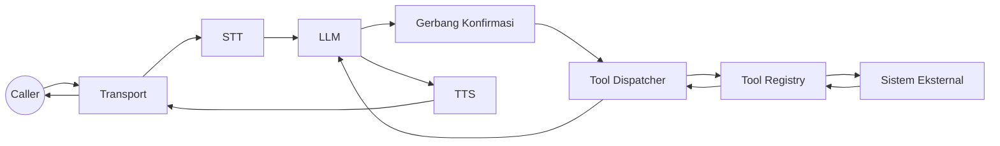

# Tugas 2: Tambah Tools (Aksi Bisnis)

Target: mengeksekusi aksi nyata dengan aman lewat konfirmasi, retry, dan timeout.

## Step 0: Tentukan Batas Tool
Gunakan tool untuk aksi yang punya efek samping (booking, pembayaran, tiket), bukan untuk reasoning murni. Ini membuat perilaku LLM lebih deterministik dan mudah diaudit.

## Peta Sistem


## Step 1: Definisikan Skema Tool
```go
llm.Tool{
  Name: "schedule_visit",
  Description: "Schedule a technician visit.",
  RequiresConfirmation: true,
  ConfirmationPromptByLanguage: map[string]string{
    "id": "Sebelum saya jadwalkan kunjungan, apakah Anda ingin saya lanjutkan?",
    "en": "Before I schedule the visit, do you want me to proceed?",
  },
  Schema: map[string]any{
    "type": "object",
    "properties": map[string]any{
      "location": map[string]any{"type": "string"},
      "preferred_time": map[string]any{"type": "string"},
    },
    "required": []string{"location", "preferred_time"},
  },
}
```

Kenapa: skema memaksa input terstruktur sehingga LLM tidak menebak-nebak parameter.

## Step 2: Implement `llm.ToolRegistry`
```go
type HVACTools struct{}

func (t *HVACTools) Tools() []llm.Tool {
  return []llm.Tool{ /* tool definitions */ }
}

func (t *HVACTools) HandleTool(name string, args map[string]any) (string, error) {
  switch name {
  case "schedule_visit":
    // panggil sistem kamu, lalu kembalikan ringkasan singkat untuk LLM
    return "visit scheduled for Tue 10am, confirmation id ABC123", nil
  default:
    return "", fmt.Errorf("unknown tool: %s", name)
  }
}
```

Return value akan masuk ke konteks LLM, jadi harus singkat dan faktual.

## Step 3: Pasang Tools ke Engine
```go
tools := &HVACTools{}
engine := ranya.NewEngine(ranya.EngineOptions{
  Config: cfg,
  Tools:  tools,
})
```

## Step 4: Konfigurasi Safety Defaults
```yaml
tools:
  timeout_ms: 6000
  retries: 1
  retry_backoff_ms: 200
  serialize_by_stream: true

confirmation:
  mode: "llm"
  llm_fallback: true
  timeout_ms: 600
```

Kenapa: eksekusi harus terukur dan konfirmasi jelas sebelum ada efek samping.

## Step 5: Ajarkan LLM Kapan Memanggil Tool
Update `base_prompt` untuk menyebut tool dan field wajibnya. Tanpa ini, tool sering tidak dipanggil.

## Step 6: Validasi di Call
Pastikan terlihat:

- `tool_call` control frame.
- `tool_result` system frame.
- Prompt konfirmasi sebelum eksekusi.

## Perbaikan Umum

- Tool tidak jalan: nama tool tidak cocok atau prompt tidak menyebut tool.
- Konfirmasi berulang: user tidak jelas, aktifkan `confirmation.llm_fallback`.
- Timeout: naikkan `tools.timeout_ms` atau optimalkan handler.

<div class="r-quick-links" markdown>
Related:

- [Tools dan Konfirmasi](tools-confirmation.md)
- [Frame dan Metadata](frames.md)
- [Observabilitas](observability.md)
</div>
