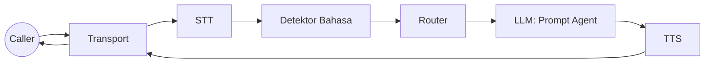

# Tugas 3: Routing + Bahasa

Target: memilih agent yang tepat (dan bahasa) sebelum LLM berjalan.

## Step 0: Tentukan Mode Routing
Set `router.mode` di config:

- `off`: single-agent.
- `bootstrap`: route hanya N turn pertama.
- `full`: route setiap STT final.

Kenapa: routing awal menjaga prompt tetap fokus dan mengurangi overhead LLM.

## Peta Sistem


## Step 1: Definisikan Agent
```go
agents := map[string]processors.AgentConfig{
  "triage": {Name: "triage", System: "You are the triage agent."},
  "technical": {Name: "technical", System: "You handle technical issues."},
  "billing": {Name: "billing", System: "You handle billing and payments."},
}
```

## Step 2: Pilih Router Strategy
Contoh HVAC memakai LLM router:
```go
llmAdapter, _ := providers.BuildLLM(cfg.Vendors.LLM.Provider, cfg)
router := NewLLMRouterStrategy(llmAdapter, nil, LLMRouterConfig{})
```

Kamu bisa membuat `processors.RouterStrategy` sendiri jika ingin aturan berbasis rule.

## Step 3: Pasang Router + Agent ke Engine
```go
engine := ranya.NewEngine(ranya.EngineOptions{
  Config: cfg,
  Agents: agents,
  Router: router,
})
```

## Step 4: Tambahkan Deteksi Bahasa (Opsional)
Contoh HVAC memakai detektor berbasis LLM:
```go
langDetector := NewLLMLanguageDetector(llmAdapter)
engine := ranya.NewEngine(ranya.EngineOptions{
  Config:           cfg,
  Agents:           agents,
  Router:           router,
  LanguageDetector: langDetector,
  LanguagePrompts:  map[string]string{"id": "...", "en": "..."},
  LanguageMinConf:  0.55,
  DefaultLanguage:  cfg.Languages.Default,
})
```

Hook config:
```yaml
router:
  mode: "bootstrap"
  max_turns: 2

languages:
  default: "id"
  code_switching: true
  prompts:
    id: "Gunakan Bahasa Indonesia."
    en: "Use English."
```

## Step 5: Verifikasi Routing
Pastikan terlihat:

- `global_update` system frame saat routing memilih agent atau bahasa.
- Metadata `agent` muncul pada text frame berikutnya.

## Perbaikan Umum

- Router tidak jalan: pastikan STT final (`source=stt`, `is_final=true`).
- Agent tidak menempel: `router.mode` off atau `max_turns` 0.
- Bahasa tidak terdeteksi: `LanguageDetector` belum terpasang atau confidence terlalu rendah.

<div class="r-quick-links" markdown>
Related:

- [Routing dan Bahasa](routing.md)
- [Frame dan Metadata](frames.md)
- [Konfigurasi](configuration.md)
</div>
