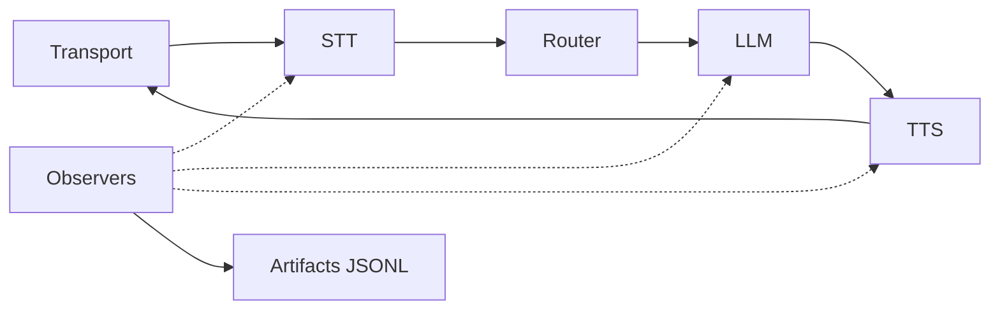

# Tugas 4: Aktifkan Observabilitas dan Debugging

Target: setiap call bisa ditelusuri lewat timeline dan trace ID.

## Peta Sistem


## Step 1: Aktifkan Artifak
```yaml
observability:
  artifacts_dir: "examples/hvac/artifacts"
  record_audio: false
  retention_days: 0
```

`artifacts_dir` wajib. Biarkan `record_audio=false` kecuali ada kebijakan privasi yang jelas.

## Step 2: Gunakan Log Terstruktur
```yaml
log_format: "json"
log_level: "info"
```

Ini memudahkan pencarian `trace_id`.

## Step 3: Debug Satu Call

1. Temukan `trace_id` di log.
2. Buka JSONL di `artifacts_dir`.
3. Cari `frame_out` terakhir, lalu telusuri stage yang berhenti.

## Step 4: Pantau Biaya dan Latensi
Saat artifak aktif, Ranya menulis timeline dan cost events. Gunakan untuk:

- membandingkan latency vendor,
- mendeteksi tool call yang lambat,
- memvalidasi keputusan routing.

## Perbaikan Umum

- Artifak tidak muncul: `artifacts_dir` kosong atau tidak bisa ditulis.
- Timeline berhenti: processor gagal atau frame drop karena backpressure.
- Biaya melonjak: cek tool call atau respons terlalu panjang.

<div class="r-quick-links" markdown>
Related:

- [Observabilitas](observability.md)
- [Pemecahan Masalah](troubleshooting.md)
</div>

## Selesai Jika

- Bisa menemukan trace call < 60 detik.
- Bisa menunjuk stage yang stalled.
- Bisa jelaskan latency dan biaya per call.
