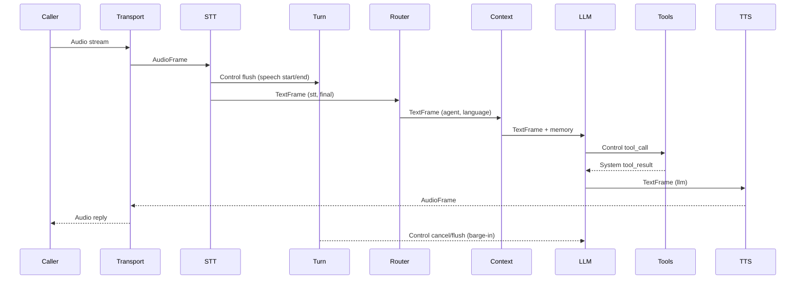

# Ranyaのアナトミー

Ranyaは生きたシステムです。音声が入り、意味が形成され、判断され、返答が話されます。このページは **なぜ各モジュールが存在するのか**、**どう接続されるのか**、**いつ触るべきか** を説明します。デバッグや拡張、置き換えを行うエンジニア向けです。

## 1. DNA — コア原則

- 決定論的ストリーミング: フレームは前に流れ、変換される。
- Provider非依存: ベンダーSDKはアダプタで隔離する。
- 明示的な状態: ルーティング、言語、ターンはメタデータで追跡。
- Observability-first: 各ステージがタイムラインとコストを記録。
- プライバシー優先: 中央で赤字化を強制できる。

## 2. Skeleton — Engineと設定

- **Module**: `pkg/ranya`, `pkg/configutil`, `pkg/pipeline`.
- **Metaphor**: 骨格が姿勢と一貫性を保つ。
- **Why**: provider、processor、transportを安定した実行系に統合する。
- **Connects**: `ranya.NewEngine` がパイプラインを構築しproviderを注入、`configutil` がYAMLを検証、`pipeline` が `FrameProcessor` を定義。
- **Touch when**: provider配線、デフォルト変更、processor追加。

## 3. Lungs — Transport

- **Module**: `pkg/transports`, `pkg/ranya/engine.go`.
- **Metaphor**: 肺が外界と空気を交換する。
- **Why**: テレフォニーのプロトコル差をフレームに正規化する。
- **Connects**: `AudioFrame` とtransportメタデータを生成し、音声フレームを受け取る。
- **Touch when**: 新しいテレフォニープロトコルやカスタムIngress。

## 4. Heart — Voice Pipeline

- **Module**: `pkg/pipeline`, `pkg/frames`, `pkg/priority`.
- **Metaphor**: 後戻りしないコンベアベルト。
- **Why**: テレフォニーは予測可能な遅延と安全な割り込み処理が必要。
- **Key concepts**: フレームが作業単位、単方向フロー、制御フレーム優先、Turn Managerが「交通整理役」。
- **Touch when**: レイテンシ調整、バックプレッシャー、ステージ順序。

## 5. Brain — Reasoning, Routing, and Memory

- **Module**: `pkg/processors/llm.go`, `pkg/processors/router.go`, `pkg/processors/context.go`, `pkg/llm`.
- **Metaphor**: 脳が意図を解釈し、適切な人格を選ぶ。
- **Why**: 音声エージェントにはルーティング、記憶、ツール呼び出しが必要。
- **Connects**: Routerが `agent` と `global_*` を設定、Contextがプロンプトを注入、LLMがツール呼び出しとストリーミング応答を出す。
- **Touch when**: メモリ挙動、カスタムルーティング、ツールロジック。

## 6. Ears — Speech to Text

- **Module**: `pkg/processors/stt_processor.go`, `pkg/providers/*` (STT).
- **Metaphor**: 耳が音を意味に変える。
- **Why**: STTはバッファリングとリプレイ、ベンダー隔離が必要。
- **Connects**: `source=stt` と `is_final` を持つ `TextFrame` を生成、`flush` 制御フレームを送る。
- **Touch when**: STTのバッファ、interim処理、ベンダー変更。

## 7. Voice — Text to Speech

- **Module**: `pkg/processors/tts_processor.go`, `pkg/providers/*` (TTS).
- **Metaphor**: 声が意図を音声に変える。
- **Why**: TTSはストリーミング音声と再生状態の同期が必要。
- **Connects**: LLMのテキストを消費し、音声フレームを出し、`audio_ready` を通知。
- **Touch when**: 音声ストリーミング、言語別ボイス、割り込み挙動。

## 8. Nervous System — Turn Management

- **Module**: `pkg/turn`, `pkg/processors/manager.go`.
- **Metaphor**: 神経系が急変に反応する。
- **Why**: 割り込みや沈黙を一貫して扱うため。
- **Connects**: `flush`, `audio_ready`, thinkingイベントを読み、`cancel` と `flush` を出す。
- **Touch when**: バージインとリプロンプト調整。

## 9. Hands — Tools and Actions

- **Module**: `pkg/ranya/dispatcher.go`, `pkg/llm/tools.go`.
- **Metaphor**: 手が現実の作業を行う。
- **Why**: ツール実行は再試行、タイムアウト、確認が必要。
- **Connects**: `tool_call` を受け、`tool_result` を返す。
- **Touch when**: ツールの安全性、冪等性、確認ルール。

## 10. Immune System — Resilience and Recovery

- **Module**: `pkg/resilience`, `pkg/errorsx`, `pkg/processors/recovery.go`.
- **Metaphor**: 免疫系が失敗を検知し回復する。
- **Why**: ベンダー障害を安全にフェイルさせるため。
- **Connects**: サーキットブレーカー、エラーマッピング、リカバリープロンプト。
- **Touch when**: フォールバック挙動、エラーハンドリング、回復ポリシー。

## 11. Eyes — Observability

- **Module**: `pkg/metrics`, `pkg/observers`.
- **Metaphor**: 目が出来事を記録する。
- **Why**: 通話デバッグにはタイムライン、遅延、コストが必要。
- **Connects**: observerが各ステージに接続しJSONLアーティファクトを書き出す。
- **Touch when**: シンク追加、赤字化ルール、コスト追跡。

## 12. Memory — Summaries and Context Limits

- **Module**: `pkg/processors/summary.go`, `pkg/processors/context.go`.
- **Metaphor**: 記憶が負荷を抑えつつ会話を保つ。
- **Why**: LLMのコンテキストは有限。要約で重要情報を保持する。
- **Connects**: `call_end` で要約、`context` が履歴をトリム。
- **Touch when**: 要約生成やコンテキスト制限。

## 13. Skin — Privacy

- **Module**: `pkg/redact`.
- **Metaphor**: 皮膚が機密情報を守る。
- **Why**: テレフォニーはPIIを含むため、ログは安全であるべき。
- **Connects**: ログやLLM入力の赤字化。
- **Touch when**: PIIポリシーやログ取り扱い。
