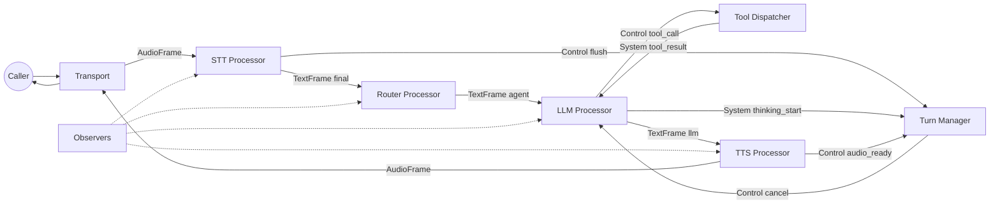

# アーキテクチャ

境界、フロー、拡張ポイントの地図です。

## システム境界

- **Transport境界** がテレフォニーイベントをFrameに変換。
- **Provider境界** がベンダーSDKを隔離。
- **Core Pipeline** が決定論的に処理。
- **Observers** が挙動を記録。

## エンドツーエンドの流れ

1. Transportが音声を受け取り `AudioFrame` を生成。
2. STTが `TextFrame` を生成し、完了時に `is_final=true`。
3. Routerが `agent` と `global_*` を設定。
4. LLMが文脈を使って応答し、必要に応じてツール呼び出し。
5. ToolDispatcherが実行し `tool_result` を返す。
6. TTSが音声化し `AudioFrame` を返す。
7. Turn managerが割り込みや沈黙を制御。

## コンポーネント図

## 拡張ポイント

- **Before LLM**: 正規化、プロンプト注入。
- **Before TTS**: 整形、短縮。
- **Post‑processor**: ログ、分析。

## コード変更不要で交換できるもの

- STT/TTS/LLM/Transportのプロバイダー。

## コード変更が必要なもの

- 新しいProcessor。
- カスタムTransport。
- 独自Tool registry。
