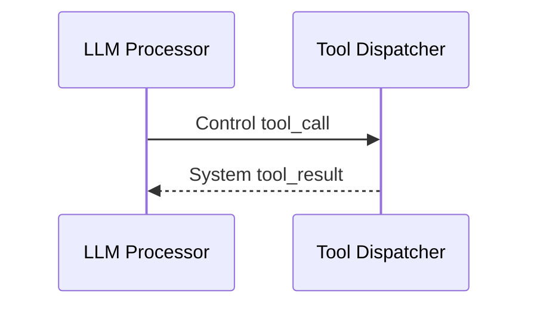

# フレームとメタデータ

FrameはRanyaの作業単位です。各ProcessorはFrameを読み、0個以上のFrameを出力します。

## 必須メタデータ

- `stream_id`
- `source`
- `is_final`

これが崩れるとルーティングやターン管理が壊れます。

## Frame種類
| Kind | 目的 | 典型的な生成元 |
| --- | --- | --- |
| `audio` | 生の音声データ。 | Transport, TTS |
| `text` | 文字起こしとLLM出力。 | STT, LLM |
| `control` | パイプライン制御信号。 | Turn, LLM |
| `system` | ユーザー非表示のイベント。 | LLM, ToolDispatcher, Turn |
| `image` | 画像入力（任意）。 | Transport or app |

## よく使う Control Codes
| Code | 意味 |
| --- | --- |
| `flush` | バッファを強制フラッシュ。 |
| `cancel` | 音声/再生をキャンセル。 |
| `tool_call` | ツール実行。 |
| `audio_ready` | TTS再生完了。 |
| `handoff` | エージェント切替。 |

## よくあるミス

- `source` 未設定のテキストフレーム。
- `is_final=true` の欠落。
- Frameのインプレース変更。

## 例: Tool Call

## デバッグチェック

- `stream_id` は一致しているか。
- `is_final=true` が付いているか。
- control frame が出ているか。
