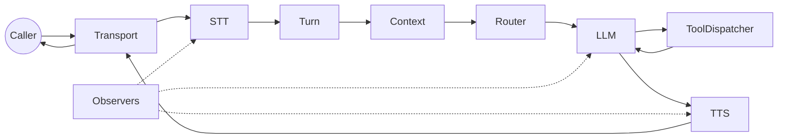

ストリーミング・テレフォニー

# Ranya

実通話に強いエンタープライズ級ボイスエージェント。決定論的パイプライン、安全なツール実行、可観測性を提供します。

[はじめに](start-here.md){.md-button .md-button--primary}
[タスクフロー](task-flows.md){.md-button}

[GitHubリポジトリ](https://github.com/harunnryd/ranya)
[Star](https://github.com/harunnryd/ranya/stargazers)
[Fork](https://github.com/harunnryd/ranya/network/members)

## 作れるもの

- **インバウンドサポート**  
  割り込みに強く、安定したレイテンシ。

- **アウトバウンドフロー**  
  状態管理と割り込み制御が明確。

- **ツール連携エージェント**  
  確認、リトライ、冪等性で安全に実行。

- **多言語展開**  
  言語検出とプロバイダー切替。

## 主要タスク

- **通話を動かす**  
  参照実装で end‑to‑end を確認。  
  [タスク1: 通話を動かす](task-1-call.md)

- **ツール追加**  
  スキーマと確認を実装。  
  [タスク2: ツール追加](task-2-tools.md)

- **ルーティング + 言語**  
  エージェントと言語を早期決定。  
  [タスク3: ルーティング + 言語](task-3-routing.md)

- **可観測性**  
  アーティファクトとtraceでデバッグ。  
  [タスク4: 可観測性](task-4-observability.md)

## 重要な判断

- **レイテンシ vs 完全性**: `pipeline.backpressure` とバッファ。  
  [パイプラインとバックプレッシャー](pipeline.md)

- **割り込み挙動**: `turn.min_barge_in_ms`。  
  [ターン管理](turn-management.md)

- **ツール安全性**: 確認とタイムアウト。  
  [ツールと確認](tools-confirmation.md)

- **ルーティング戦略**: `router.mode` と言語検出。  
  [ルーティングと言語](routing.md)

- **デバッグ戦略**: アーティファクトとtrace ID。  
  [可観測性](observability.md)

## データフロー（高レベル）

