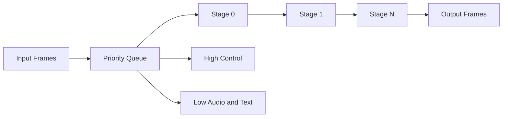

# パイプラインとバックプレッシャー

Ranyaは通話ごとに動く段階式パイプラインを持ちます。

## デフォルトのProcessor順序
`pkg/ranya/engine.go`:

1. Pre‑processor
2. STT
3. Turn
4. Before‑context
5. Context
6. Router
7. Before‑LLM
8. LLM
9. Tool dispatcher
10. Before‑TTS
11. TTS
12. Post‑processors

## Backpressureモード

- `drop`: 満杯時に破棄。
- `wait`: 空きを待つ。

使い分け:

- **Drop** は低レイテンシ。
- **Wait** はテスト/オフライン。

## チューニング例
| 目的 | 設定 |
| --- | --- |
| 最低レイテンシ | `backpressure=drop`, バッファ小。 |
| 高信頼性 | `backpressure=wait`, バッファ大。 |
| デバッグ | `pipeline.async=false`. |
| 高負荷 | `highcapacity`/`lowcapacity`/`stagebuffer` を増やす。 |

## 図

