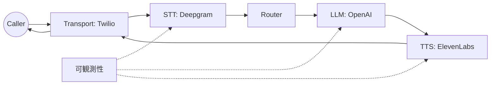

# タスク1: 通話を動かす

目的: 実プロバイダー (Twilio + STT + TTS + LLM) で1本の通話を完走させる。

## Step 0: プロバイダーを選ぶ
推奨スタック (HVAC例と同じ):

- Transport: Twilio
- STT: Deepgram
- TTS: ElevenLabs
- LLM: OpenAI

理由: HVAC例はエンドツーエンドで動作確認済みのベースライン。

## システムマップ


## Step 1: 参照設定をコピー
```bash
cp examples/hvac/config.yaml config.yaml
```

最低限必要な項目:

- `transports.provider`
- `vendors.stt.provider`
- `vendors.tts.provider`
- `vendors.llm.provider`

最小構成 (抜粋):
```yaml
transports:
  provider: twilio
  settings:
    account_sid: "${TWILIO_ACCOUNT_SID}"
    auth_token: "${TWILIO_AUTH_TOKEN}"
    public_url: "${TWILIO_PUBLIC_URL}"

vendors:
  stt:
    provider: deepgram
    settings:
      api_key: "${DEEPGRAM_API_KEY}"
      model: "nova-2"
  tts:
    provider: elevenlabs
    settings:
      api_key: "${ELEVENLABS_API_KEY}"
      voice_id: "${ELEVENLABS_VOICE_ID}"
  llm:
    provider: openai
    settings:
      api_key: "${OPENAI_API_KEY}"
      model: "gpt-4o-mini"
```

## Step 2: クレデンシャルを用意
環境変数を設定:

- `TWILIO_ACCOUNT_SID`
- `TWILIO_AUTH_TOKEN`
- `TWILIO_PUBLIC_URL`
- `DEEPGRAM_API_KEY`
- `ELEVENLABS_API_KEY`
- `ELEVENLABS_VOICE_ID`
- `OPENAI_API_KEY`

`TWILIO_PUBLIC_URL` は公開到達可能である必要があります。ローカルならトンネル (ngrok, cloudflared) を使ってください。

## Step 3: 例を実行
```bash
go run ./examples/hvac --config config.yaml
```

期待される状態:

- `ranya_init` ログに選択したproviderが表示される。
- Twilio transportは `transports.settings.server_addr` (デフォルト `:8080`) で待受。

## Step 4: 電話番号をRanyaへ向ける
Twilio Voice webhook:
`https://<public-url>/voice`

RanyaはTwiMLを返し、`ws_path` (デフォルト `/ws`) にメディアストリームを開きます。

## Step 5: エンドツーエンドを確認
以下が見えるはずです:

- `source=stt` と `is_final=true` のSTTフレーム。
- LLMテキストフレーム。
- Transportへ送られるTTS音声。

タイムラインを有効化:
```yaml
observability:
  artifacts_dir: "examples/hvac/artifacts"
```

## Step 6: タイムラインで高速デバッグ

1. ログから `trace_id` を取得。
2. `artifacts_dir` のJSONLを開く。
3. 最後の `frame_out` を探し、停止したステージを修正。

よくある修正:

- inboundなし: `TWILIO_PUBLIC_URL` が到達不可、または `voice_path` が誤り。
- STTがfinalにならない: STT設定かエンコーディング不一致。
- LLMが無反応: API key不足、モデル未対応。
- TTSが無反応: voice ID不正、出力フォーマット不一致。

<div class="r-quick-links" markdown>
Related:

- [プロバイダー](providers.md)
- [可観測性](observability.md)
- [トラブルシューティング](troubleshooting.md)
</div>

## 完了条件

- 通話がエンドツーエンドで完走。
- タイムラインから障害点を特定できる。
- コード変更なしでproviderを差し替えられる。
