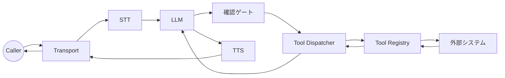

# タスク2: ツール追加 (ビジネスアクション)

目的: 確認、リトライ、タイムアウト付きで安全に実行する。

## Step 0: ツール境界を決める
ツールは副作用のある処理 (予約、決済、チケット作成) に使います。推論だけの処理はツール化しない方が安全です。

## システムマップ


## Step 1: ツールスキーマを定義
```go
llm.Tool{
  Name: "schedule_visit",
  Description: "Schedule a technician visit.",
  RequiresConfirmation: true,
  ConfirmationPromptByLanguage: map[string]string{
    "id": "Sebelum saya jadwalkan kunjungan, apakah Anda ingin saya lanjutkan?",
    "en": "Before I schedule the visit, do you want me to proceed?",
  },
  Schema: map[string]any{
    "type": "object",
    "properties": map[string]any{
      "location": map[string]any{"type": "string"},
      "preferred_time": map[string]any{"type": "string"},
    },
    "required": []string{"location", "preferred_time"},
  },
}
```

理由: スキーマが構造化入力を強制し、誤ったパラメータを減らせる。

## Step 2: `llm.ToolRegistry` を実装
```go
type HVACTools struct{}

func (t *HVACTools) Tools() []llm.Tool {
  return []llm.Tool{ /* tool definitions */ }
}

func (t *HVACTools) HandleTool(name string, args map[string]any) (string, error) {
  switch name {
  case "schedule_visit":
    // 自社システムを呼び、LLMに返す短い結果を返す
    return "visit scheduled for Tue 10am, confirmation id ABC123", nil
  default:
    return "", fmt.Errorf("unknown tool: %s", name)
  }
}
```

返り値はLLMのコンテキストに入るため、短く事実ベースで。

## Step 3: Engineにツールを接続
```go
tools := &HVACTools{}
engine := ranya.NewEngine(ranya.EngineOptions{
  Config: cfg,
  Tools:  tools,
})
```

## Step 4: Safetyデフォルトを設定
```yaml
tools:
  timeout_ms: 6000
  retries: 1
  retry_backoff_ms: 200
  serialize_by_stream: true

confirmation:
  mode: "llm"
  llm_fallback: true
  timeout_ms: 600
```

理由: 実行時間を制限し、実行前の確認を保証するため。

## Step 5: LLMにツール利用を教える
`base_prompt` にツール名と必要フィールドを明示します。これが無いとツールが呼ばれにくいです。

## Step 6: 通話で検証
以下が見えるはずです:

- `tool_call` のcontrolフレーム。
- `tool_result` のsystemフレーム。
- 実行前の確認プロンプト。

## よくある修正

- ツールが呼ばれない: tool名不一致、またはプロンプトが触れていない。
- 確認がループ: 返答が曖昧。`confirmation.llm_fallback` を有効化。
- タイムアウト: `tools.timeout_ms` を増やすかhandlerを最適化。

<div class="r-quick-links" markdown>
Related:

- [ツールと確認](tools-confirmation.md)
- [フレームとメタデータ](frames.md)
- [可観測性](observability.md)
</div>
