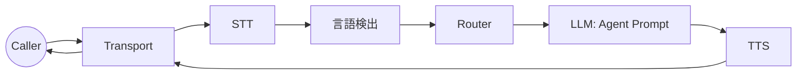

# タスク3: ルーティング + 言語

目的: LLMの前に適切なエージェントと言語を選ぶ。

## Step 0: ルーティングモードを決める
`router.mode` を設定:

- `off`: 単一エージェント。
- `bootstrap`: 最初のNターンのみルーティング。
- `full`: すべてのSTT finalでルーティング。

理由: 早期ルーティングでプロンプトを集中させ、LLM負荷を下げる。

## システムマップ


## Step 1: エージェントを定義
```go
agents := map[string]processors.AgentConfig{
  "triage": {Name: "triage", System: "You are the triage agent."},
  "technical": {Name: "technical", System: "You handle technical issues."},
  "billing": {Name: "billing", System: "You handle billing and payments."},
}
```

## Step 2: Router Strategyを選ぶ
HVAC例はLLMルーターを使います:
```go
llmAdapter, _ := providers.BuildLLM(cfg.Vendors.LLM.Provider, cfg)
router := NewLLMRouterStrategy(llmAdapter, nil, LLMRouterConfig{})
```

ルールベースなら `processors.RouterStrategy` を自作できます。

## Step 3: Router + AgentをEngineに接続
```go
engine := ranya.NewEngine(ranya.EngineOptions{
  Config: cfg,
  Agents: agents,
  Router: router,
})
```

## Step 4: 言語検出を追加 (任意)
HVAC例はLLMベースの検出器:
```go
langDetector := NewLLMLanguageDetector(llmAdapter)
engine := ranya.NewEngine(ranya.EngineOptions{
  Config:           cfg,
  Agents:           agents,
  Router:           router,
  LanguageDetector: langDetector,
  LanguagePrompts:  map[string]string{"id": "...", "en": "..."},
  LanguageMinConf:  0.55,
  DefaultLanguage:  cfg.Languages.Default,
})
```

設定フック:
```yaml
router:
  mode: "bootstrap"
  max_turns: 2

languages:
  default: "id"
  code_switching: true
  prompts:
    id: "Gunakan Bahasa Indonesia."
    en: "Use English."
```

## Step 5: ルーティングを確認
以下が見えるはずです:

- エージェントや言語決定時の `global_update` systemフレーム。
- 後続のtextフレームに `agent` メタデータ。

## よくある修正

- ルーターが動かない: STT final (`source=stt`, `is_final=true`) を確認。
- エージェントが固定されない: `router.mode` が `off` か `max_turns` が0。
- 言語が検出されない: `LanguageDetector` 未設定または信頼度が低すぎる。

<div class="r-quick-links" markdown>
Related:

- [ルーティングと言語](routing.md)
- [フレームとメタデータ](frames.md)
- [設定](configuration.md)
</div>
