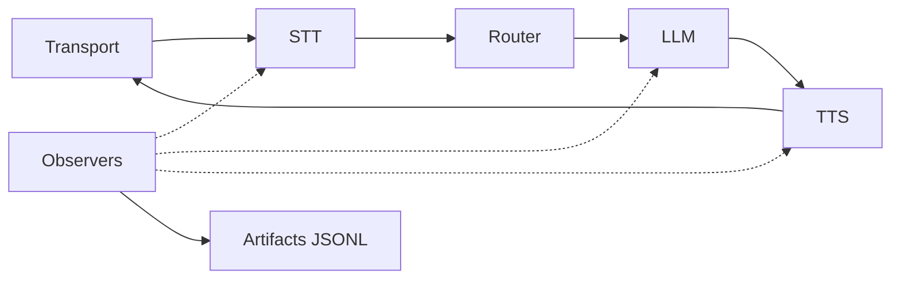

# タスク4: 可観測性とデバッグを有効化

目的: すべての通話をタイムラインとtrace IDで追跡できるようにする。

## システムマップ


## Step 1: アーティファクトを有効化
```yaml
observability:
  artifacts_dir: "examples/hvac/artifacts"
  record_audio: false
  retention_days: 0
```

`artifacts_dir` は必須です。`record_audio=false` はプライバシーポリシーがある場合のみ変更してください。

## Step 2: 構造化ログを使う
```yaml
log_format: "json"
log_level: "info"
```

これで `trace_id` を検索しやすくなります。

## Step 3: 単一通話をデバッグ

1. ログから `trace_id` を取得。
2. `artifacts_dir` のJSONLを開く。
3. 最後の `frame_out` を確認し、停止したステージを特定。

## Step 4: コストとレイテンシを見る
アーティファクト有効時、Ranyaはタイムラインとコストイベントを記録します。以下に使えます:

- ベンダー間のレイテンシ比較、
- 遅いツール呼び出しの検知、
- ルーティング判断の検証。

## よくある修正

- アーティファクトが出ない: `artifacts_dir` が未設定か書き込み不可。
- タイムラインが途中で止まる: processor失敗、または backpressure でドロップ。
- コストが高い: ツール呼び出しや長文応答を確認。

<div class="r-quick-links" markdown>
Related:

- [可観測性](observability.md)
- [トラブルシューティング](troubleshooting.md)
</div>

## 完了条件

- 60秒以内に通話のtraceを見つけられる。
- 止まったステージを特定できる。
- 通話ごとのレイテンシとコストを説明できる。
